# DBCheck - Database Inspection Tool

DBCheck is an open-source, cross-platform automated database health check tool that supports six mainstream relational databases: **MySQL**, **PostgreSQL**, **Oracle**, **SQL Server**, **DM8**, and **TiDB**. The tool automatically generates standardized Microsoft Word inspection reports by executing predefined SQL checks and collecting system resources. It also provides advanced features such as historical trend analysis, AI-powered intelligent diagnostics, configuration baseline compliance checks, index health analysis, in-depth slow query analysis, and data-masked export. DBCheck aims to free DBAs from repetitive and time-consuming manual inspection work, improving database operation and maintenance efficiency and risk detection capabilities.


[]()
[]()
[]()
[]()
[]()
[]()
[]()
[]()
[]()

> Language: [English](./README.md) | [中文](./README_zh.md)

## 🌍 Multi-Language Support

DBCheck supports **Chinese (default)** and **English**. All interface text updates automatically when you switch languages.

### CLI Language Switch

```bash
python main.py                    # Default: Chinese
python main.py --lang en         # Switch to English
python main.py --lang zh         # Switch to Chinese (explicit)
```

> The Web UI also has a 🌐 toggle button in the top-right corner. Clicking it switches between Chinese and English. The setting is automatically saved and will be loaded on the next Web UI startup.

### Language Reference

| Parameter | Language | Notes |
|-----------|----------|-------|
| `--lang zh` | Chinese | Default language |
| `--lang en` | English | English interface |
| (not specified) | Chinese | Uses the last saved language; falls back to Chinese if no record exists |

> **Note**: The `--lang` parameter only takes effect for the current session and does not overwrite any saved language setting. Switching language in the Web UI persists to `dbc_config.json` and loads automatically on the next startup.

### Manually Modify Default Language

To change the default language without using CLI flags or Web UI, edit the configuration file directly:

```json
// dbc_config.json
{
    "language": "zh"   // "zh" = Chinese, "en" = English
}
```

The config file is located in the same directory as `main.py`.

## AI-Assisted - Detect and Resolve Issues

### AI-Powered Intelligent Diagnosis

Leveraging a fully offline, local **Ollama** deployment, DBCheck analyzes inspection metrics (connection counts, cache hit ratios, slow queries, security risks, etc.) and automatically generates structured optimization recommendations. AI insights are rendered as a dedicated chapter in the report — Markdown content is automatically styled into Word format (bold, code blocks, lists, numbered headings), ready to share with your team or leadership.

| Backend | Characteristics | Use Case |
|---------|----------------|----------|
| `ollama` | Local-only, zero cost, no network dependency | Air-gapped environments, high data-security requirements |
| `disabled` | AI disabled (default) | Offline environments / AI not required |

> **Security Notice**: AI diagnosis is strictly limited to local Ollama (localhost:11434). Inspection data is never sent to any third-party service. This is enforced at the code level — even if the configuration file is tampered with to use a remote address, the system will automatically fall back to the disabled state.

### Risk Detection and Recommendations

Each risk is presented as a card: **Risk Level (High/Medium/Low) → Issue Description → Remediation SQL (copy-paste ready) → Priority & Owner**. The report automatically aggregates all findings so you can see every pending item at a glance.

| Dimension | MySQL | PostgreSQL | Oracle | SQL Server | DM8 | TiDB |
|-----------|:-----:|:----------:|:------:|:-----------:|:---:|:----:|
| Connection Resources | ✅ | ✅ | ✅ | ✅ | ✅ | ✅ |
| Cache Performance | ✅ | ✅ | ✅ | ✅ | ✅ | ✅ |
| Query Efficiency | ✅ | ✅ | ✅ | ✅ | ✅ | ✅ |
| Logs and Alerts | ✅ | ✅ | ✅ | ✅ | ✅ | ✅ |
| Security Audit | ✅ | ✅ | ✅ | ✅ | ✅ | ✅ |
| Replication / DG | ✅ | ✅ | — | — | — | ✅ |
| Configuration Tuning | ✅ | ✅ | ✅ | ✅ | ✅ | ✅ |
| Tablespaces | — | — | ✅ | ✅ | ✅ | — |
| SGA / PGA Memory | — | — | ✅ | — | ✅ | — |
| Redo Logs | — | — | ✅ | — | ✅ | — |
| Backup and Archiving | — | — | ✅ | ✅ | ✅ | — |
| RAC Cluster | — | — | ✅ | — | — | — |
| ASM Disk Groups | — | — | ✅ | — | — | — |
| Undo Management | — | — | ✅ | — | ✅ | — |
| Data Guard | — | — | ✅ | — | — | — |
| Wait Events | — | — | ✅ | ✅ | ✅ | — |
| Locks and Blocking | — | — | — | ✅ | — | — |
| DM8-Specific Views | — | — | — | — | ✅ | — |
| Placement & Affinity | — | — | — | — | — | ✅ |

---

## Four Core Capabilities

| Capability | Description |
|-----------|-------------|
| 📊 Historical Trend Analysis | Automatically aggregates data from multiple inspection runs on the same database, generates metric trend line charts, and compares against previous results to surface changes |
| 🤖 AI-Powered Diagnosis | Calls local Ollama based on inspection metrics to generate personalized optimization recommendations |
| 🔍 130+ Enhanced Rules | Full-dimensional risk detection across six databases (MySQL 35+, PG 27+, Oracle 20+, SQL Server 15+, DM8 16+, TiDB 18+) — including 28 new slow query deep analysis rules |
| 🔒 Desensitize Report | Auto-masks IP, port, username, service name in exported Word report to prevent info leakage |

---

## Four Ways to Use DBCheck

| Method | Description |
|--------|-------------|
| 🖥️ Command-Line | `python main.py` — terminal interaction, ideal for CLI-familiar users |
| 🌐 Web UI | `python web_ui.py` — browser-based GUI with trend charts and AI configuration |
| 🤖 OpenClaw Skill | Tell your AI assistant "inspect the Oracle Database" — fully automated |
| 📦 Packaged Distribution | PyInstaller bundles everything into a single executable for team distribution |

---

## Features

### Database Inspection

| Dimension | MySQL | PostgreSQL | Oracle | SQL Server | DM8 | TiDB |
|-----------|:-----:|:----------:|:------:|:-----------:|:---:|:----:|
| Basic Info (version / instance / database) | ✅ | ✅ | ✅ | ✅ | ✅ | ✅ |
| Session and Connection Status | ✅ | ✅ | ✅ | ✅ | ✅ | ✅ |
| Memory and Cache Configuration | ✅ | ✅ | ✅ | ✅ | ✅ | ✅ |
| Tablespace Usage | — | — | ✅ | ✅ | ✅ | — |
| SGA / PGA Memory Analysis | — | — | ✅ | — | ✅ | — |
| Redo Log Status | — | — | ✅ | — | ✅ | — |
| Archiving and Backup Checks | — | — | ✅ | ✅ | ✅ | — |
| Key Parameter Configuration | ✅ | ✅ | ✅ | ✅ | ✅ | ✅ |
| Invalid Object Detection | ✅ | ✅ | ✅ | ✅ | ✅ | ✅ |
| User Security Audit | ✅ | ✅ | ✅ | ✅ | ✅ | ✅ |
| Top SQL / Slow Queries | ✅ | ✅ | ✅ | ✅ | ✅ | ✅ |
| Master-Slave Replication / Data Guard | ✅ | ✅ | — | — | — | ✅ |
| RAC Cluster Information | — | — | ✅ | — | — | — |
| ASM Disk Groups | — | — | ✅ | — | — | — |
| Undo Tablespace Management | — | — | ✅ | — | ✅ | — |
| Recycle Bin / Flashback Recovery Area | — | — | ✅ | — | ✅ | — |
| Profile Password Policy | — | — | ✅ | — | — | — |
| Top Wait Events | — | — | ✅ | ✅ | ✅ | — |
| Locks and Blocking Detection | — | — | — | ✅ | — | — |
| Stale Statistics Detection | — | — | ✅ | ✅ | ✅ | ✅ |
| Partitioned Table Information | — | — | ✅ | ✅ | ✅ | ✅ |
| Datafile Status | — | — | ✅ | ✅ | ✅ | — |
| DM8 Buffer Pool Details | — | — | — | — | ✅ | — |
| Placement & Affinity Policy | — | — | — | — | — | ✅ |

### Configuration Baseline Checks

> Automatically compares current configuration values against recommended baselines based on database size, memory, and workload — helping identify misconfigurations before they cause problems.

#### MySQL (22 parameters)

| Parameter | Description | Recommended Value Basis |
|-----------|-------------|------------------------|
| innodb_buffer_pool_size | InnoDB buffer pool size | 60–80% of total memory |
| max_connections | Maximum connections | 1.5× historical peak usage |
| tmp_table_size / max_heap_table_size | Temp & memory table size | 64MB; should match each other |
| innodb_log_file_size | Redo log file size | 256MB–1GB based on DB size |
| innodb_log_buffer_size | Log buffer size | 16MB |
| sync_binlog | Binlog sync frequency | 1 for high-write workloads |
| innodb_flush_log_at_trx_commit | Transaction log flush policy | 1 (strictest, safest) |
| table_open_cache / table_definition_cache | Table & definition cache | 2× table count / threads |
| thread_cache_size | Thread cache size | 50+ or 2–4× CPU cores |
| innodb_thread_concurrency | InnoDB concurrency | 2× CPU cores |
| innodb_io_capacity / io_capacity_max | I/O capacity (SSD/HDD) | 20000 / 200 |
| max_allowed_packet | Max packet size | 16MB–64MB |
| wait_timeout / interactive_timeout | Connection idle timeout | 300–600 seconds |
| sort_buffer_size / join_buffer_size | Sort & join buffer | 2–4MB / 1–2MB |
| long_query_time | Slow query threshold | 1–2 seconds |

#### PostgreSQL (21 parameters)

| Parameter | Description | Recommended Value Basis |
|-----------|-------------|------------------------|
| shared_buffers | Shared buffer size | 25% of total memory |
| effective_cache_size | Effective cache size | 75% of total memory |
| maintenance_work_mem | Maintenance memory | 256MB–1GB |
| work_mem | Work memory | (total_mem × 0.25) / max_connections |
| max_connections | Maximum connections | 200–1000 |
| temp_buffers / wal_buffers | Temp & WAL buffers | 8MB / 16MB |
| checkpoint_completion_target | Checkpoint completion target | 0.9 |
| max_wal_size / min_wal_size | WAL size bounds | 2GB / 256MB |
| random_page_cost | Random page cost | 1.1 (SSD) / 4.0 (HDD) |
| effective_io_concurrency | I/O concurrency | 200 (SSD) |
| shared_preload_libraries | Preloaded libraries | Should include pg_stat_statements |
| track_activities / track_counts | Statistics tracking | on |
| track_io_timing / track_functions | I/O & function tracking | on / pl |
| autovacuum | Auto vacuum | on |
| log_min_duration_statement | Slow query threshold | 1000–3000ms |

#### Oracle (12 parameters)

| Parameter | Description | Recommended Value Basis |
|-----------|-------------|------------------------|
| memory_target | Memory target (SGA+PGA) | 85% of physical memory |
| sga_target / pga_aggregate_target | SGA / PGA targets | 60% / 25% of total memory |
| processes | Maximum processes | 150 or CPU cores × 50 |
| open_cursors / session_cached_cursors | Cursor settings | 300–500 / 50 |
| log_buffer | Log buffer size | 8–64MB |
| undo_retention | Undo retention time | 3600 seconds |
| fast_start_mttr_target | MTTR target | 300 seconds |
| db_file_multiblock_read_count | Multiblock read count | 128 |
| statistics_level | Statistics level | TYPICAL |
| control_file_record_keep_time | Control file record retention | 7 days |

#### SQL Server (6 parameters)

| Parameter | Description | Recommended Value Basis |
|-----------|-------------|------------------------|
| max server memory (MB) | Max server memory | 85% of physical memory |
| cost threshold for parallelism | Parallelism cost threshold | 25–50 |
| max degree of parallelism | Max DOP | CPU cores / 2 |
| fill factor (%) | Fill factor | 80–90% |
| recovery interval (min) | Recovery interval | 60 minutes |
| backup compression default | Backup compression | 1 (enabled) |

#### DM8 (7 parameters)

| Parameter | Description | Recommended Value Basis |
|-----------|-------------|------------------------|
| MEMORY_TARGET | Memory target | 85% of physical memory |
| SGA_TARGET / PGA_TARGET | SGA / PGA targets | 60% / 25% of total memory |
| MAX_SESSIONS / OPEN_CURSORS | Session & cursor limits | 1000 / 500 |
| UNDO_RETENTION | Undo retention time | 3600 seconds |
| BUFFER | Buffer pool size | 30% of DB size |

#### TiDB (9 parameters)

| Parameter | Description | Recommended Value Basis |
|-----------|-------------|------------------------|
| innodb_buffer_pool_size | InnoDB buffer pool size | 70% of total memory |
| max_connections | Maximum connections | 3000 |
| tmp_table_size / max_heap_table_size | Temp & memory table size | 256MB; should match |
| innodb_log_file_size / innodb_log_buffer_size | Log file & buffer | 256MB / 64MB |
| max_allowed_packet | Max packet size | 64MB |
| tidb_hash_join_concurrency / tidb_index_lookup_concurrency | Operator concurrency | 5 each |

### Index Health Analysis

> Detects three types of index issues across all supported databases — missing indexes, redundant/duplicate indexes, and long-unused indexes — then generates actionable remediation recommendations.

#### MySQL

| Analysis Type | Data Source | Description |
|---------------|-------------|-------------|
| Missing indexes | performance_schema.events_statements_summary_by_digest + table_statistics | Identifies high-scan queries and tables lacking primary keys |
| Redundant indexes | information_schema.STATISTICS | Finds duplicate indexes on the same column(s) |
| Unused indexes | performance_schema.table_statistics | Detects indexes with zero read/write activity |

#### PostgreSQL

| Analysis Type | Data Source | Description |
|---------------|-------------|-------------|
| Missing indexes | pg_stat_statements | Identifies high-row-scan queries needing indexes |
| Redundant indexes | pg_indexes (indexdef parsing) | Finds identical or left-prefix-matching index pairs |
| Unused indexes | pg_stat_user_indexes (idx_scan=0) | Detects never-scanned indexes |

#### Oracle

| Analysis Type | Data Source | Description |
|---------------|-------------|-------------|
| Unused indexes | v$object_usage (MONITORING USAGE) | Detects indexes that have never been used |
| Redundant indexes | dba_ind_columns | Finds same-column-at-position-1 index pairs |

#### SQL Server

| Analysis Type | Data Source | Description |
|---------------|-------------|-------------|
| Unused indexes | sys.dm_db_index_usage_stats | Detects indexes with zero user_seeks + user_scans |
| Redundant indexes | sys.indexes + sys.index_columns | Finds same-leading-column index pairs |

#### DM8

| Analysis Type | Data Source | Description |
|---------------|-------------|-------------|
| Redundant indexes | USER_IND_COLUMNS | Finds identical or containing column index pairs |

#### TiDB

| Analysis Type | Data Source | Description |
|---------------|-------------|-------------|
| Redundant indexes | information_schema.STATISTICS | Finds identical or left-prefix-matching index pairs |

### System Resource Monitoring

- **CPU**: utilization, core count, clock speed
- **Memory**: total, used, available, utilization rate
- **Disk**: capacity and utilization per mount point
- **Collection**: local collection or SSH remote collection (password/key auth supported, default port 22); Dameng DM8 supports SSH collection with automatic fallback to local collector on failure

### Intelligent Risk Analysis

Automatically detects potential database risks — **each risk includes an executable remediation SQL** ready to copy and run:

#### MySQL (18+ rules)

| Dimension | Example Rules |
|-----------|--------------|
| Connections | Usage >90% = critical / >80% = warning |
| Memory | InnoDB buffer pool too small (< 60% of data size) |
| Disk | Usage >85% = warning / >95% = critical |
| Queries | Long-running SQL (>60s), slow query log disabled |
| Locks | High lock wait ratio |
| Security | Empty password users, root@% exposure, non-UTF8 charset |
| Replication | Master-slave lag >30s, replication errors |
| Other | binlog disabled, query cache remnants, excessive aborted connections |

#### PostgreSQL (16+ rules)

| Dimension | Example Rules |
|-----------|--------------|
| Connections | Near limit, too many superusers |
| Cache | Low hit ratio (<80%), undersized shared_buffers |
| Performance | Large accumulation of dead tuples, long-running SQL |
| Security | Overly permissive public schema permissions |
| Archiving | Archiving mode disabled |
| Other | Disk / memory / CPU resource alerts |

#### Oracle (20+ rules)

| Dimension | Example Rules |
|-----------|--------------|
| Tablespace | Usage >90% (including autoextend calculation) |
| TEMP | Temp tablespace usage too high |
| Sessions | Near limit / process overflow / lock blocking |
| Memory | SGA too large relative to physical memory |
| Redo | Redo log group issues / frequent switches |
| Backup | Archiving disabled / missing RMAN backups |
| DG | MRP not running / protection mode too low |
| ASM | Disk group space insufficient / offline disks |
| FRA | Flashback Recovery Area usage too high |
| Objects | Too many invalid objects / stale statistics |
| Security | Permissive Profile password policy / auditing disabled |
| Other | open_cursors too small / recycle bin bloat / datafiles offline |

#### DM8 (16+ rules)

| Dimension | Example Rules |
|-----------|--------------|
| Tablespace | Usage >90% (including autoextend calculation) |
| Memory | Pool misconfigurations (KEEP/RECYCLE/FAST/NORMAL/ROLL) |
| Sessions | Near connection limit / long-running sessions |
| Transactions | Blocking transaction detection / waits |
| Backup | Missing backup sets / backup timeouts |
| Parameters | Key parameters (INSTANCE_MODE, COMPATIBLE_VERSION, etc.) |
| Security | Empty passwords / overly broad permissions / auditing disabled |
| Objects | Invalid objects / stale statistics / partitioned table info |
| Archiving | Archiving disabled / log accumulation |

#### SQL Server (15+ rules)

| Dimension | Example Rules |
|-----------|--------------|
| Connections | Current connections near maximum limit |
| Sessions | Active sessions anomalies / long-running sessions |
| Waits | Wait statistics TOP10 / wait type analysis |
| Locks | Current lock info / lock waits and blocking chains |
| Deadlocks | Deadlock history detection / blocking process analysis |
| Backups | Recent backup missing / backup type check |
| Database | Database status / recovery model / file sizes |
| Memory | Memory clerk usage / buffer pool hit ratio |
| Performance | Top SQL sorted by CPU / IO / execution time |

#### TiDB (18+ rules)

| Dimension | Example Rules |
|-----------|--------------|
| Connections | Usage >90% = critical / >80% = warning |
| Memory | TiDB memory configuration anomalies |
| Disk | Usage >85% = warning / >95% = critical |
| Queries | Long-running SQL (>60s), slow query log disabled |
| Locks | Lock wait events / deadlock detection |
| Security | Empty password users, root@% exposure, non-UTF8 charset |
| Replication | TiCDC/PD heartbeat anomalies / follower lag |
| Placement | Placement rules misconfiguration / affinity policy |
| Stats | Stale statistics / auto-analyze disabled |
| Other | binlog disabled, excessive aborted connections, system CPU/memory pressure |

### Historical Trend Analysis

> Run multiple inspections on the same database, and DBCheck automatically aggregates the data to generate trend charts — spotting gradual changes before they become incidents.

- After each inspection, key metrics (memory utilization, connections, QPS, CPU, etc.) are written to a local **SQLite database** (`db_history.db`), surviving process restarts
- Data is aggregated per database (IP + port + type), retaining up to 30 historical snapshots per instance
- SQLite storage is wrapped by `SQLiteHistoryManager`; the original `HistoryManager` API is fully preserved — no migration needed for existing code
- Graceful degradation: if SQLite is unavailable (permissions, locking), the system automatically falls back to in-memory mode without blocking inspections
- The Web UI provides a **trend analysis page** with line charts and threshold lines
- Side-by-side comparison with the previous run: changes shown with colored arrows (↑ deteriorating / ↓ improving)

### AI-Powered Diagnosis

> Leveraging inspection data, DBCheck calls a local Ollama LLM to generate personalized optimization recommendations — evolving from "problem detection" to "problem resolution".

Comparison of Intelligent Analysis vs. AI Diagnosis:

| | Intelligent Analysis | AI Diagnosis |
|---|---|---|
| Principle | Fixed rules, deterministic offline judgment | Local LLM inference, personalized output |
| Speed | Milliseconds | Depends on model response time |
| Output | Deterministic conclusions + remediation SQL | Natural language recommendations, Markdown auto-rendered to Word |
| Invocation | Runs automatically on every inspection | On-demand (can be disabled) |

**AI Backend Configuration (Web UI Settings):**

| Parameter | Description |
|-----------|-------------|
| Backend Type | `ollama` or `disabled` |
| API Address | Default `http://localhost:11434` (localhost only) |
| Model Name | e.g. `qwen3:30b`, `qwen3:8b`, `llama3`, etc. |
| Timeout | Default 600 seconds (LLM cold start can be slow) |

> For security reasons, any non-localhost API address is automatically rejected by the code to prevent data leakage.

### Slow Query Deep Analysis 🔍

> Beyond basic slow query detection, DBCheck performs multi-dimensional deep analysis — correlating execution plans, I/O patterns, lock waits, and temporary table usage — then feeds the results directly into AI diagnostics for intelligent root cause analysis.

#### What It Does

When a database exhibits slow query symptoms, DBCheck collects the Top N worst-performing queries across multiple performance dimensions, performs automated risk rule analysis, and then invokes the AI advisor to generate targeted optimization recommendations.

#### Data Collection Dimensions

Each database has its own optimized query for capturing the most expensive statements:

| Database | Data Source | Collection Dimensions |
|----------|-------------|------------------------|
| **MySQL** | `performance_schema.events_statements_summary_by_digest` | Execution latency, full table scans, lock waits, temporary tables, sort operations |
| **PostgreSQL** | `pg_stat_statements` | Total time, avg time, I/O time, temp blocks, current long-running queries |
| **Oracle** | `v$sql` | Buffer Gets, Disk Reads, Elapsed Time |
| **SQL Server** | `sys.dm_exec_query_stats` | CPU usage, logical reads, elapsed time, physical reads |
| **DM8** | `V$SQL` | Execution time, disk reads |
| **TiDB** | `information_schema.cluster_slow_query` | Query time, memory usage, scan rows, Coprocessor tasks |

#### Integration with Inspection Flow

```
checkdb() execution order:
1. getData() → SQL inspection queries
2. checkdb() → Intelligent risk analysis
3. Slow Query Deep Analysis ← NEW (auto-executed after AI diagnosis)
4. context['slow_query_result'] → smart_analyze_* for risk rule evaluation
5. AI Advisor → injects slow_query_top3 + slow_query_count metrics
```

The `SlowQueryResult` container standardizes the output from all database analyzers, ensuring consistent downstream processing regardless of database type.

#### Enhanced Risk Rules

The inspection engine adds database-specific slow query rules:

**MySQL (new rules 17+):**
- `performance_schema` not enabled
- Full table scan detection
- Lock wait ratio threshold
- AI diagnosis injection of slow query findings

**PostgreSQL (new rules 11+):**
- `pg_stat_statements` extension not enabled
- High-latency query detection
- High I/O query detection
- Long-running query threshold
- AI diagnosis injection of slow query findings

#### AI Diagnosis Enhancement

A dedicated `build_slow_query_ai_prompt()` function generates a targeted diagnostic prompt. The AI advisor receives:

- **slow_query_top3**: The three most impactful slow queries (by latency, I/O, or execution frequency)
- **slow_query_count**: Total number of slow queries captured

This enables the AI to provide precise, query-level optimization advice rather than generic recommendations.

#### Output in Report

Slow query analysis results appear in the report's risk chapter, tagged with severity levels (🔴 High / 🟡 Medium / 🟢 Low) and paired with actionable remediation SQL.

---

## Environment Requirements

- **Operating System**: Linux / macOS / Windows
- **Python**: 3.6+
- **General Dependencies**: pymysql, psycopg2-binary, python-docx, docxtpl, paramiko, psutil, openpyxl, pandas, flask, flask_socketio
- **Oracle Dependencies**: `oracledb` (recommended, pure Python, no Instant Client needed) or `cx_Oracle` (requires Oracle Instant Client)
- **DM8 Dependencies**: `dmpython` (pip install dmpython)
- **SQL Server Dependencies**: `pyodbc` + ODBC Driver 17 (supported on Windows and Linux)
- **MySQL Privileges**: Read-only access to information_schema, performance_schema, and mysql databases
- **PostgreSQL Privileges**: Read-only access to pg_stat_* series views and pg_roles
- **Oracle Privileges**: Read-only access to v$* and dba_* views; SYSDBA privileged connections supported (Web UI checkbox for one-click enablement)
- **SQL Server Privileges**: Read-only access to sys.databases, sys.master_files, and sys.dm_* dynamic management views
- **DM8 Privileges**: Read-only access to V$* system views and DBA_* admin views; default port 5236; connecting user equals Schema (no `database` parameter needed)
- **TiDB Dependencies**: `pymysql` (same as MySQL — TiDB uses the MySQL protocol; default port **4000**)
- **TiDB Privileges**: Read-only access to information_schema, performance_schema, and mysql databases (identical to MySQL)

### Installing Dependencies

```bash
pip install -r requirements.txt
```

> 💡 **Database Driver Notes:**
>
> - **Oracle**: `oracledb` (recommended, pure Python, no Instant Client needed)
> - **DM8**: `dmpython` (Dameng official driver)
> - **SQL Server**: Requires [ODBC Driver 17](https://docs.microsoft.com/en-us/sql/connect/odbc/download-odbc-driver-for-sql-server) installed separately

> DM8 Driver Notes:
> - `dmpython`: Pure Python driver provided by Dameng (pip install dmpython), recommended
> - Connection parameters: host + port (default 5236) + username (no `database` parameter — the user is the Schema)
> - DM8's V$ view column names differ significantly from Oracle; the tool includes targeted adaptations for DM8

> Oracle Driver Notes:
> - `oracledb`: Pure Python implementation, no Instant Client required, recommended
> - `cx_Oracle`: Requires downloading [Oracle Instant Client](https://www.oracle.com/database/technologies/instant-client.html) and configuring environment variables

---

## Quick Start

```bash
python main.py
```

The main menu offers nine options:

```
==================================================
  🗄️  Database Automation Inspector  v2.3  Main Menu
==================================================
    🐬  1 │ MySQL           MySQL Health Inspection & Report
    🐘  2 │ PostgreSQL      PostgreSQL Health Inspection & Report
    🔴  3 │ Oracle          Oracle Deep Health Inspection (20+ Checks)
    🟠  4 │ SQL Server      SQL Server Health Inspection & Report
    🟡  5 │ DM8             Dameng DM8 Health Inspection & Report
    🐬  6 │ TiDB            TiDB Health Inspection & Report (MySQL 8.0 Compatible)

    🌐  7 │ Launch Web UI   Browser-based GUI
    📋  8 │ Batch Template  Generate Batch Inspection Excel Template
    ❌  0 │ Exit
==================================================
```

1. Enter **1–5** to enter the inspection menu for the corresponding database type
2. Enter **6** to enter the TiDB inspection menu
3. Enter **7** to launch the Web UI
4. Enter **8** to select a template type to generate (MySQL / PostgreSQL / Oracle / SQL Server / DM8 / TiDB)
5. Enter **0** to exit

#### Single Instance Inspection (Oracle as Example)

1. Select **3** to enter the Oracle inspection menu
2. Select **1** for single-instance inspection
3. Fill in as prompted:
   - Inspection name
   - Database IP / port (default 1521) / service name or SID
   - Username (SYSDBA supported — Web UI checkbox, CLI accepts `sys as sysdba` syntax) / password
   - SSH info (optional, default port 22, used for system resource collection)
4. The tool runs 42 SQL checks → collects system info → runs intelligent risk analysis → AI diagnosis (optional)
5. A Word inspection report is generated

#### Batch Inspection

1. Generate the corresponding Excel batch inspection template via option **4**
2. Fill in connection information for multiple database instances in the template
3. Select **2** for batch inspection — the program automatically runs through all instances

### Web UI

Start the web service and visit **http://localhost:5003** in your browser to perform all inspections via the GUI.

```bash
python web_ui.py
```

**Web UI Workflow:**

| Step | Function |
|:---:|---------|
| 1 | Select database type (🐬 MySQL / 🐘 PostgreSQL / 🔴 Oracle / 🟠 SQL Server / 🟡 DM8 / 🐬 TiDB) |
| 2 | Fill in connection info — Oracle requires service name/SID; DM8 does not need a database name |
| 3 | Online connection testing (SYSDBA privileged verification via checkbox) |
| 4 | Configure SSH for system resource collection (optional, default port 22; DM8 supports SSH with auto-fallback) |
| 5 | Inspector name (default: dbcheck), optionally check "🔒 Desensitize Report" to mask sensitive info |
| 6 | Confirm and execute with one click — real-time log streaming (SSE) |
| 7 | Upon completion, preview intelligent analysis + AI diagnosis results online |
| 8 | 📊 Historical trend analysis: view metric trends across multiple inspection runs |
| 9 | 🤖 AI diagnosis settings: configure local Ollama parameters (address / model / timeout) |
| 10 | Download the Word report and browse historical reports |

### OpenClaw Skill

DBCheck is published as an OpenClaw Skill on [ClawHub](https://clawhub.ai/skills/dbcheck). Once installed in your AI assistant, you can trigger inspections via natural language — no CLI or Web UI needed.

#### Installation

Run in your OpenClaw client:

```bash
clawhub install dbcheck
```

#### Usage

After installation, simply tell your AI assistant what you need, for example:

> "Inspect the Oracle Database at IP localhost, username sys as sysdba"

The AI assistant will load the Skill, ask for missing information step by step (port, service name, inspector name, etc.), then invoke the inspection script to generate a Word report.

#### Supported Commands

| Example Command | Description |
|---------------|-------------|
| Help me inspect a MySQL Database | Single-instance MySQL inspection |
| Help me inspect a PostgreSQL Database | Single-instance PG inspection |
| Help me inspect an Oracle Database | Single-instance Oracle inspection |
| Inspect Oracle at localhost | Quick inspection targeting a specific IP |
| Generate a database inspection report | Trigger the full inspection workflow |

#### Skill File Structure

```
dbcheck/skill/dbcheck/
├── SKILL.md               # Skill documentation
├── security.md            # Security notes
└── scripts/
    ├── run_inspection.py       # Non-interactive entry point
    ├── main_mysql.py           # MySQL inspection logic
    ├── main_pg.py              # PostgreSQL inspection logic
    ├── main_oracle_full.py     # Oracle inspection logic (20+ checks)
    ├── main_sqlserver.py       # SQL Server inspection logic
    ├── main_dm.py              # Dameng DM8 inspection logic
    ├── main_tidb.py             # TiDB inspection logic
    ├── analyzer.py             # Intelligent risk analysis engine
    ├── slow_query_analyzer.py   # Slow query deep analysis engine (MySQL/PG/Oracle/SQLServer/DM8)
    └── main.py                 # Unified menu entry
```

> **Security Notice**: Skill credentials are used only to establish local connections and are never sent to any third party. AI diagnosis uses local Ollama exclusively.

---

## Packaging and Distribution

Use the PyInstaller configuration file `dbcheck.spec` to bundle everything into a single executable containing all dependencies, templates, and project modules:

```bash
cd D:\DBCheck

# Clean old build (Windows)
rd /s /q build dist __pycache__ 2>nul

# Package
pyinstaller dbcheck.spec
```

> On Linux/macOS, use `rm -rf build dist __pycache__` to clean.

Run the packaged version:

```bash
cd dist
dbcheck.exe         # Windows
./dbcheck           # Linux/macOS
```

Double-click to run the full-featured program with all database drivers, Word templates, and Web UI templates included — no Python environment installation required.

---

## Report Structure

The generated Word report contains the following chapters (Oracle inspection report example):

| Chapter | Content (Oracle Inspection) |
|---------|----------------------------|
| Cover | Database name, server address, version, hostname, uptime, inspector, platform, report timestamp |
| Chapter 1 | OS Host Information (CPU / Memory / Disk) |
| Chapter 2 | Database Basic Information (version / instance name / database name) |
| Chapter 3 | Tablespaces (permanent + temporary, including autoextend) |
| Chapter 4 | SGA / PGA Memory Analysis |
| Chapter 5 | Key Parameter Configuration |
| Chapter 6 | Undo Tablespace Management |
| Chapter 7 | Redo Logs |
| Chapter 8 | Archiving and Backup |
| Chapter 9 | Data Guard Status |
| Chapter 10 | RAC Cluster Information |
| Chapter 11 | ASM Disk Groups |
| Chapter 12 | Sessions and Connections (including Top 5 Wait Events) |
| Chapter 13 | Performance Metrics (including AWR snapshot analysis) |
| Chapter 14 | Alert Log Analysis |
| Chapter 15 | Users and Security |
| Chapter 16 | Invalid Objects and Statistics |
| Chapter 17 | Partitioned Table Information |
| Chapter 18 | FRA Flashback Recovery Area |
| Chapter 19 | Recycle Bin |
| Chapter 20 | Risks and Recommendations (intelligent analysis details + remediation SQL quick reference) |
| Chapter 21 | AI Diagnosis Recommendations (Markdown auto-rendered to Word with numbered headings, code blocks, lists) |
| Chapter 22 | Report Notes |

> Report structure varies slightly by database type, but all include the six core modules: cover, basic information, performance analysis, risk recommendations, AI diagnosis, and report notes.

---

## FAQ

### General

1. **Some content is empty or missing**
   When template rendering encounters compatibility issues, the program automatically switches to a fallback rendering mode and still produces a complete report with all key data — usage is unaffected.

2. **Connection failure**
   Verify that the database allows remote access, the user has sufficient privileges, and the firewall permits the relevant port.

3. **SSH collection failure**
   Confirm the SSH service is running (default port 22) and authentication credentials are correct. Some stripped-down Linux distributions lack commands like `lscpu`, causing CPU information to show "not obtained" — this is normal.

4. **AI diagnosis not working**
   - Confirm a valid configuration is saved in Web UI → AI Diagnosis Settings
   - Ensure Ollama is running: `ollama serve`
   - Ensure the model is downloaded: `ollama pull qwen3:30b` (larger models recommended; cold start is slow)

5. **Risk recommendations are for reference only**
   Built-in thresholds are based on general best practices. Evaluate them in the context of your actual workload.

### Oracle-Specific

6. **ORA-01017 invalid username/password**
   - For SYSDBA access: check the "SYSDBA" box in Web UI; in CLI, enter `sys as sysdba` (full format) — the tool automatically parses and uses the correct privileged mode
   - Verify the password is correct (case-sensitive)

7. **ORA-00904 / ORA-00942 invalid identifier**
   Some advanced views/columns may not exist in certain Oracle versions (e.g., 11g vs 19c). The tool handles compatibility gracefully; incompatible items are marked with ⚠️ and skipped without affecting the overall inspection.

8. **Do I need to install an Oracle client?**
   - Using `oracledb` driver (recommended): No — pure Python implementation
   - Using `cx_Oracle` driver: Yes — download [Oracle Instant Client](https://www.oracle.com/database/technologies/instant-client.html)

9. **Oracle version support**
   Supports **11g R2, 12c, 19c, 21c** and above. SQL templates are cross-version compatible.

### DM8-Specific

10. **Connection failure (returned a result with an exception set)**
    - dmPython uses lazy connections — a successful connection object creation does not mean the connection is actually established; a probe SQL must be executed via cursor to confirm
    - The tool includes built-in auto-probe logic. If it still fails, check: correct port (default 5236), correct user password, and whether the server allows access from your IP

11. **"Invalid column name" error**
    - DM8's V$ view column names differ significantly from Oracle; the tool has been adapted for DM8实测 column names. If errors persist, please send a screenshot so we can add support.

12. **SSH collection not available**
    - Limited by the Dameng server's OpenSSH version (port 2022), SSH collection is temporarily disabled. System resource information will use the local collector. Local and Dameng server information being inconsistent is expected.

13. **"Server hostname/platform" in the report shows local machine info**
    - A known limitation when SSH collection is disabled; Dameng server system info collection depends on the SSH channel and will be addressed in a future version.

### SQL Server-Specific

14. **Connection failure**
    - Confirm SQL Server allows remote connections (SQL Server Configuration Manager → Network Configuration → TCP/IP enabled)
    - Confirm firewall allows port 1433 (or custom port)
    - Confirm correct authentication mode (Windows Authentication or Mixed Mode)

15. **pyodbc installed but connection fails**
    - ODBC Driver 17 required: install via `curl https://packages.microsoft.com/keys/microsoft.asc | apt-key add -` then install mssql-server
    - On Linux: `curl https://packages.microsoft.com/config/ubuntu/$(lsb_release -rs)/prod.list | tee /etc/apt/sources.list.d/mssql-release.list`

16. **SQL Server version support**
    - Supports **SQL Server 2012, 2014, 2016, 2017, 2019, 2022** and above

---

## Screenshots

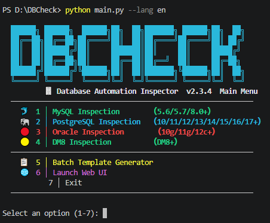

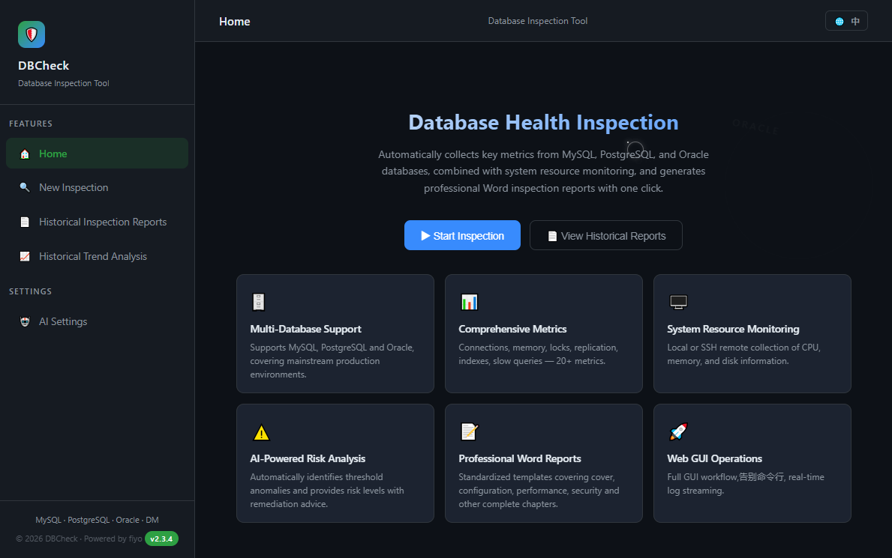
*Fig. 1: Select database type (MySQL 🐬 / PostgreSQL 🐘 / Oracle 🔴 / DM8 🟡)*

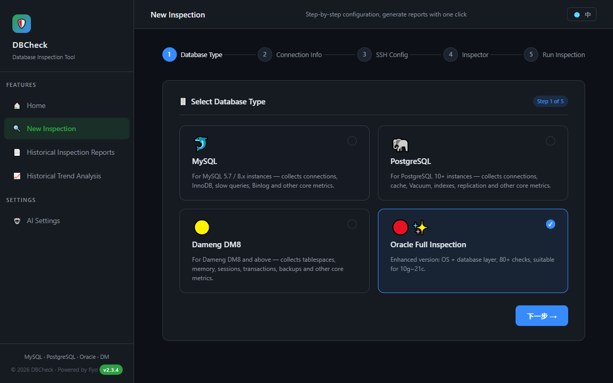
*Fig. 2: Fill in database connection information*

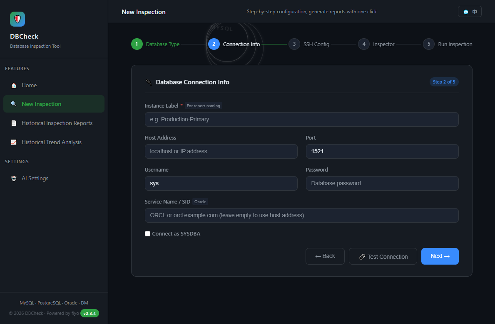
*Fig. 3: Online connection testing*


*Fig. 4: SSH configuration (optional, default port 22)*

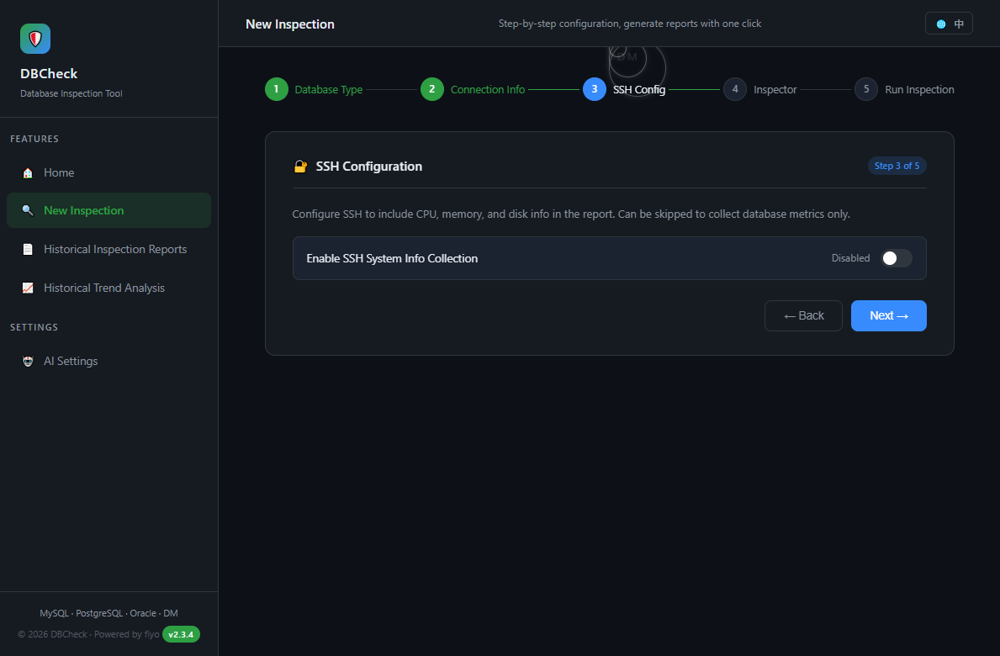
*Fig. 5: Inspector name configuration (default: dbcheck)*

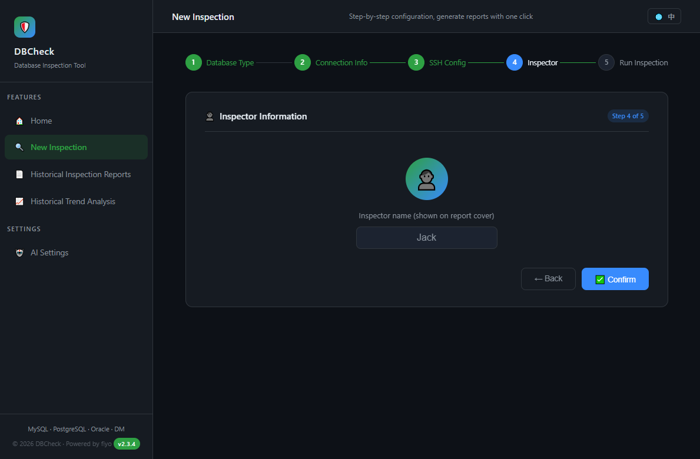
*Fig. 6: Confirm inspection information*

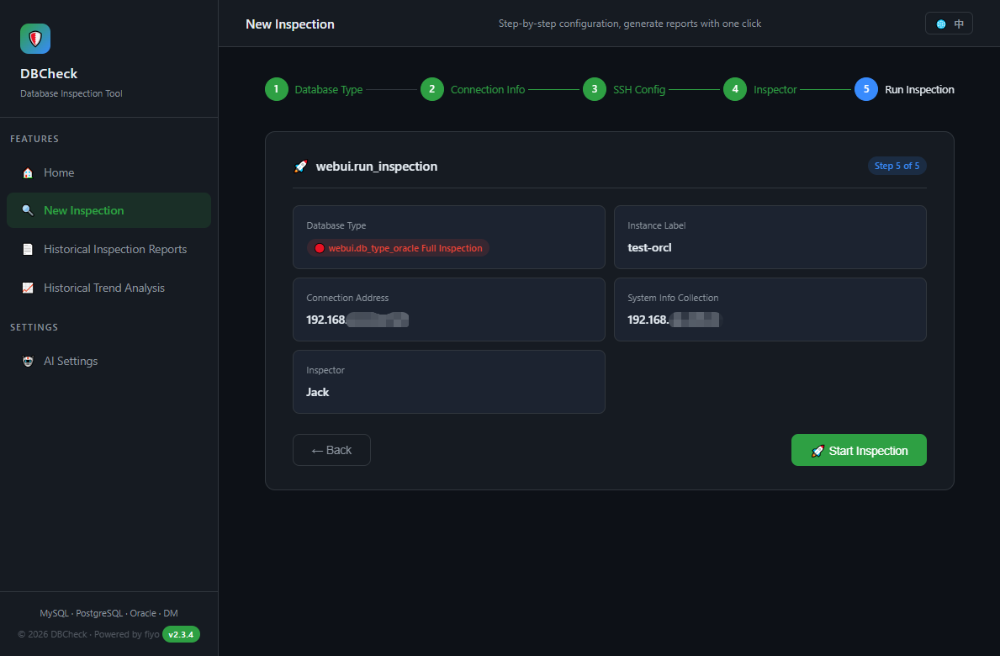
*Fig. 7: One-click inspection with real-time log streaming*

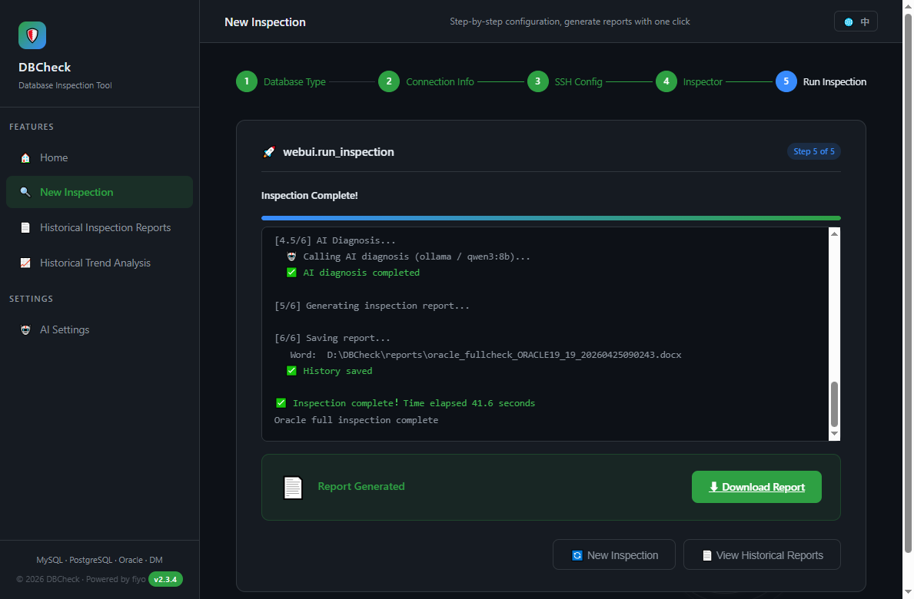
*Fig. 8: Download Word report directly after inspection*

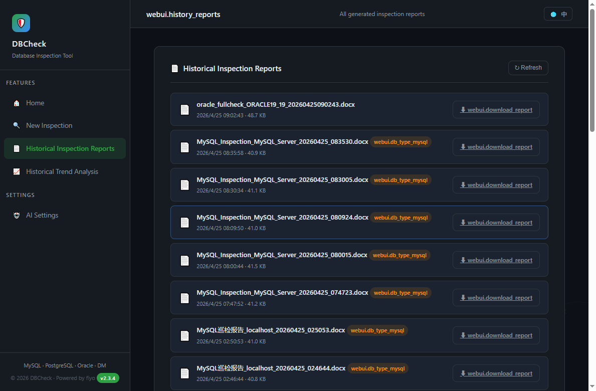
*Fig. 9: Historical report list, browsable by name, size, and time*


*Fig. 10: Historical trend analysis*

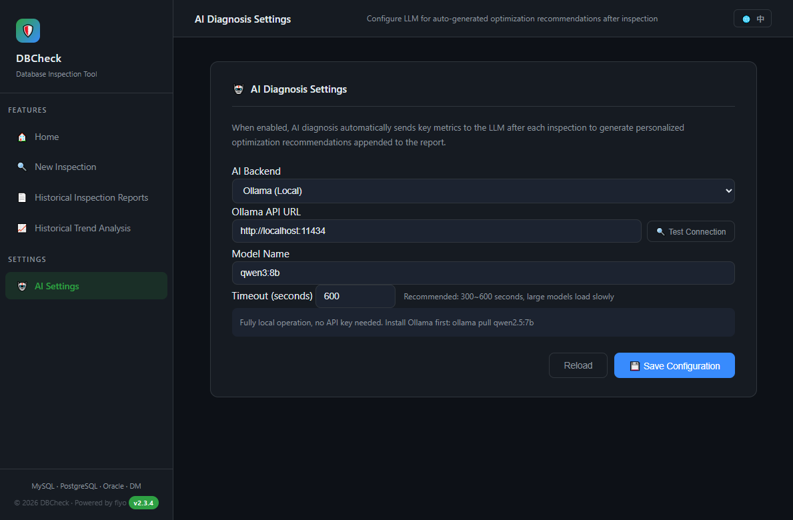
*Fig. 11: AI diagnosis configuration — fully local, no API key needed, data never leaves your machine*


*Fig. 12: dbcheck published on ClawHub*


*Fig. 13: Using dbcheck in QClaw and other OpenClaw-compatible applications*

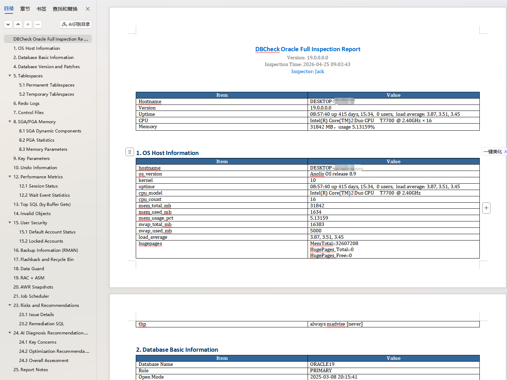
*Fig. 14: AI diagnosis report (Markdown auto-rendered to Word format)*

---

## Acknowledgments

>This project referred to the following projects, and we would like to thank the original project author for their efforts:

* [Zhh9126/MySQLDBCHECK](https://github.com/Zhh9126/MySQLDBCHECK.git)
* [Zhh9126/SQL-SERVER-CHECK](https://github.com/Zhh9126/SQL-SERVER-CHECK.git)

Some features are still undergoing rapid iteration, and more database types will be added in the future to enhance their own functionality. We welcome joint participation in feature development and feedback on issues and suggestions.

---

## Support the Project

DBCheck has undergone extensive iteration and real-world testing to reach its current state. If this tool has been helpful to you, consider supporting the project's continued development:


> When donating, please include your name or nickname so we know who supports us ❤️
>
> Contact: sdfiyon@gmail.com

## Donor List

Thank you to everyone who has supported this project! ❤️

| Date | Name / Nickname | Message |
|------|------------------|---------|
| 2026-4-28 | *ck | |
| 2026-4-29 | *嵘 | |
| *Looking forward to your support!* | | |

> If you've donated but don't see your name here, please contact us at sdfiyon@gmail.com to have it added.
