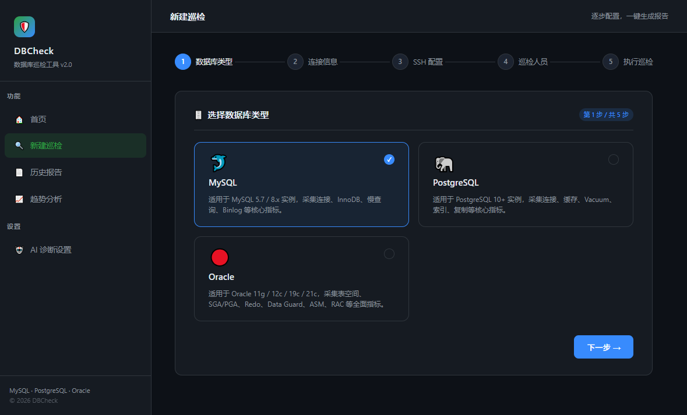
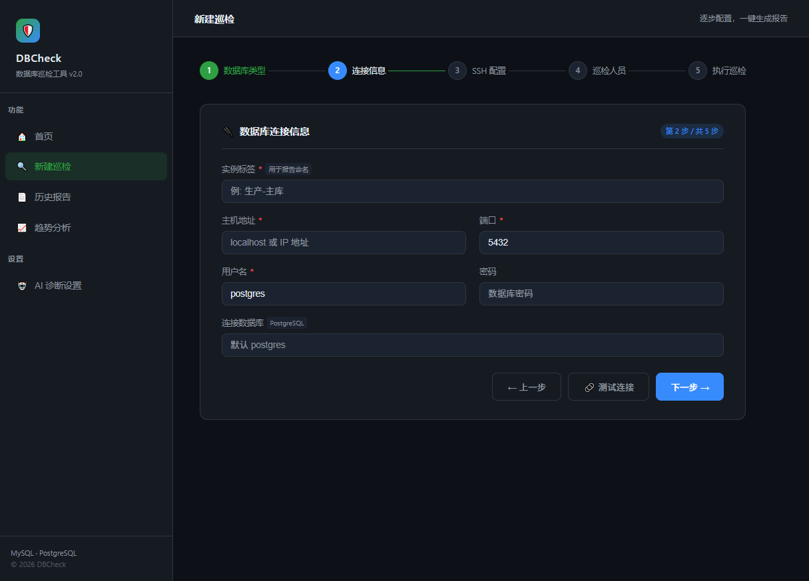
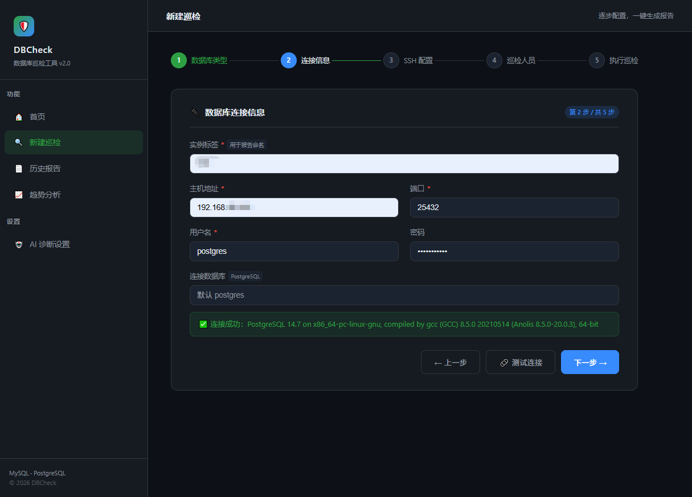
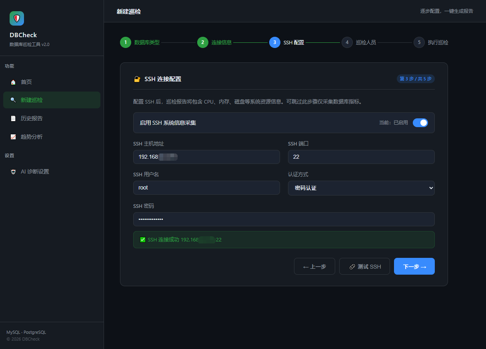
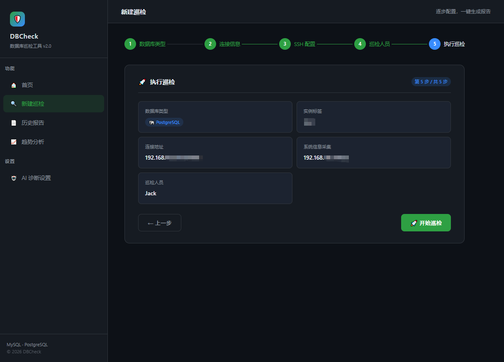
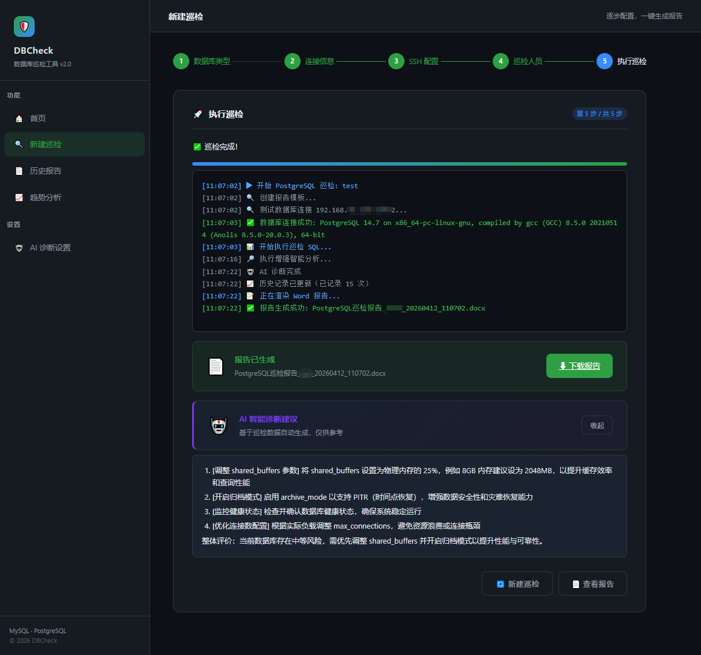
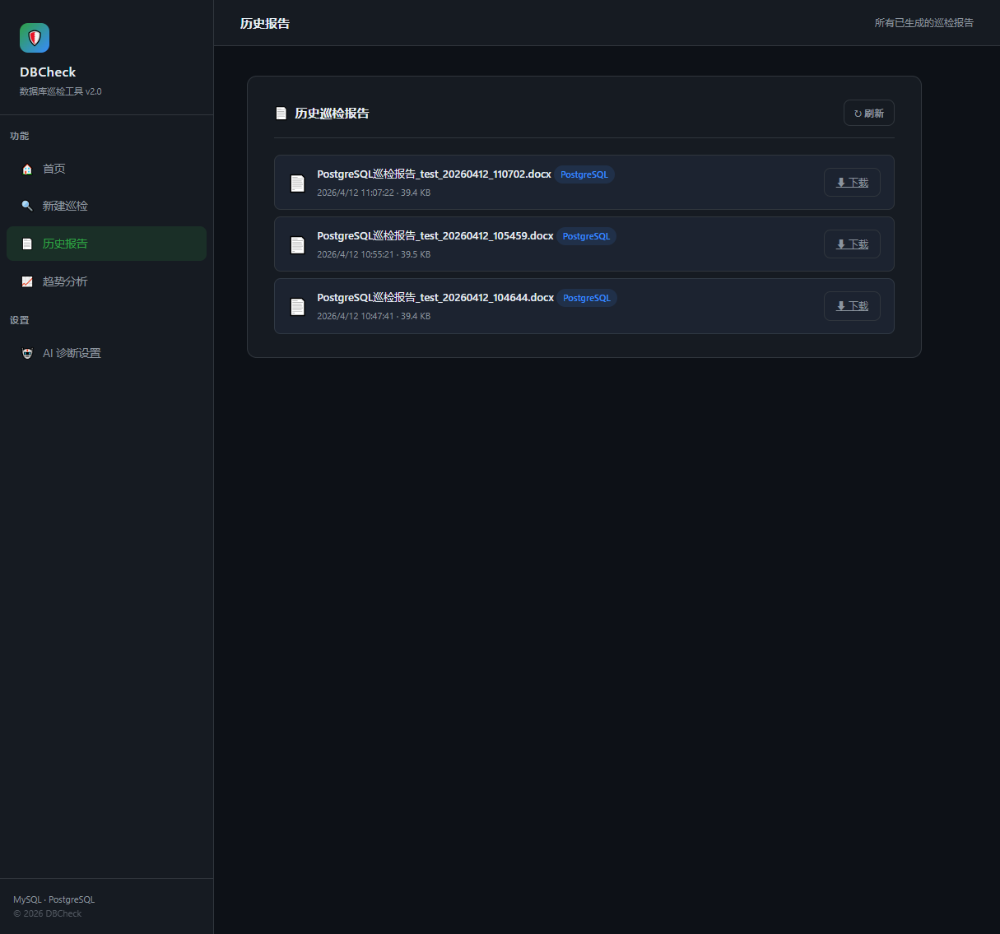

# 数据库巡检工具 - DBCheck

本工具支持对 **MySQL** 和 **PostgreSQL** 两种主流关系型数据库进行自动化健康巡检，生成格式规范的 Microsoft Word 报告，帮助 DBA 和运维人员快速掌握数据库运行状况。

> 本项目由 [Zhh9126/MySQLDBCHECK](https://github.com/Zhh9126/MySQLDBCHECK.git) 改进而来，在原 MySQL 支持的基础上新增了 PostgreSQL 支持。

---

## 功能特性

### 数据库巡检

| 维度 | MySQL | PostgreSQL |
|------|:-----:|:----------:|
| 连接与会话状态 | ✅ | ✅ |
| 内存与缓存配置 | ✅ | ✅ |
| 日志与存储 | ✅ | ✅ |
| 性能与锁 | ✅ | ✅ |
| 索引使用情况 | ✅ | ✅ |
| 数据库对象 | ✅ | ✅ |
| 安全与用户 | ✅ | ✅ |
| 实例信息 | ✅ | ✅ |
| 复制与主从状态 | ✅ | ✅ |
| 缓存命中率 | ✅ | ✅ |
| 后台写入器状态 | — | ✅ |
| 已安装扩展 | — | ✅ |
| 关键参数配置 | ✅ | ✅ |

### 系统资源监控

- **CPU**：使用率、核心数、频率
- **内存**：总量、使用量、可用量、使用率
- **磁盘**：各挂载点容量及使用率
- **采集方式**：本地直采或 SSH 远程采集（支持密码/密钥认证）

### 风险分析

- 自动检测连接数使用率过高、磁盘/内存紧张等风险项
- 每项风险包含等级、描述、优先级及优化建议

### 报告输出

- 自动生成结构清晰的 Word 报告，含封面、目录、数据表格及结论建议
- 文件以「数据库标签 + 时间戳」命名，便于归档管理

### 巡检模式

- **单机巡检**：交互式输入，快速生成单台报告
- **批量巡检**：通过 Excel 模板配置多台数据库，一键批量生成

---

## 环境要求

- **操作系统**：Linux / macOS / Windows
- **Python**：3.6 及以上
- **依赖**：pymysql、psycopg2-binary、python-docx、docxtpl、paramiko、psutil、openpyxl、pandas
- **MySQL 权限**：查询 information_schema、performance_schema、mysql 库的只读权限
- **PostgreSQL 权限**：查询 pg_stat_* 系列系统视图及 pg_roles 的只读权限
- **SSH（可选）**：用于远程采集系统资源

---

## 快速开始

### 安装依赖

```bash
pip3 install pyinstaller pymysql psycopg2-binary paramiko openpyxl docxtpl python-docx pandas psutil==5.9.0
```

### 启动巡检

```bash
python3 main.py
```

数据库类型菜单提供五个选项：
| 选项 | 说明 |
|:---:|------|
| 1 | MySQL - MySQL 数据库健康检查与报告生成|
| 2 | PostgreSQL - PostgreSQL 数据库健康检查与报告生成 |
| 3 | 生成 Excel 批量巡检模板（MySQL） |
| 4 | 生成 Excel 批量巡检模板（PostgreSQL） |
| 5 | 退出 |

1. 选择菜单 **1** 或 **2**，进入 `MySQL` 或 `PostgreSQL` 巡检功能菜单
2. 选择菜单 **3** 或 **4**，生成 `mysql_batch_template.xlsx` 或 `pg_batch_template.xlsx` 配置模板
3. 选择菜单 **5** 退出工具

功能菜单提供四个选项：
| 选项 | 说明 |
|:---:|------|
| 1 | 单机巡检 |
| 2 | 批量巡检（从 Excel 导入） |
| 3 | 创建 Excel 配置模板 |
| 4 | 退出 |

#### 单机巡检
1. 选择 **1**  进入单机巡检
2. 根据提示填写数据库连接信息及 SSH 信息（可选）
3. 工具自动进行巡检并生成 word巡检报告

#### 批量巡检

1. 选择菜单 **2**，程序自动读取配置并依次巡检所有实例
2. 工具自动根据 Excel 模型中的内容批量巡检

> 注意：Excel 模板中请勿明文保存密码，填写完成后注意妥善保管配置文件。

### Web UI（可视化界面）

启动 Web 服务后，在浏览器访问 **http://localhost:5000** 即可通过图形界面完成所有巡检操作，无需记忆命令行参数。

```bash
pip3 install flask
python3 web_ui.py
```

**操作流程：**

| 步骤  | 说明 |
|:---:|:------|
| 1 | 选择数据库类型（MySQL / PostgreSQL） |
| 2 | 填写连接信息，支持在线测试连接 |
| 3 | 配置 SSH 采集系统资源（可选） |
| 4 | 填写巡检人员姓名 |
| 5 | 确认信息后一键执行，实时查看日志进度 |
| 6 | 巡检完成，在线下载 Word 报告 |
| 7 | 历史报告页面，随时查阅和下载过往报告 |

**界面截图：**


*图 1：选择数据库类型（MySQL 🐬 / PostgreSQL 🐘）*


*图 2：填写数据库连接信息*


*图 3：在线连接测试数据库连接*


*图 4：SSH 连接配置（可选）*


*图 5：测试 SSH 连接*


*图 6：巡检人员配置*


*图 7：确认巡检信息*


*图 8：一键巡检，实时预览巡检进度*


*图 9：巡检完成后直接在页面下载 Word 报告*


*图 10：历史报告列表页，支持按名称、大小、时间浏览*

---

## 打包部署

```bash
pyinstaller --onefile --name dbcheck \
    --hidden-import pymysql \
    --hidden-import psycopg2 \
    --hidden-import docx \
    --hidden-import docxtpl \
    --hidden-import paramiko \
    --hidden-import psutil \
    --hidden-import openpyxl \
    --hidden-import pandas \
    main.py
```

打包后在 `dist` 目录下执行：

```bash
cd dist
./dbcheck
```

---

## 报告结构

生成的 Word 报告包含以下章节：

- **封面**：数据库基本信息、巡检人员、报告时间
- **健康状态概览**：总体评级及发现问题数量
- **系统资源检查**：CPU、内存、磁盘详细指标
- **数据库配置检查**：连接、内存、日志相关关键参数
- **性能分析**：QPS、锁信息、异常连接、索引使用情况
- **数据库信息**：各库大小、当前活跃进程、已安装扩展
- **安全信息**：数据库用户列表及权限概要
- **风险与建议**：自动分析出的潜在问题及优化方向

---

## 常见问题

1. **部分内容为空或缺失**
   模板渲染出现兼容性问题时，程序会自动切换至备用渲染模式，仍可生成包含所有关键数据的完整报告，不影响使用。

2. **连接失败**
   检查数据库是否允许远程访问、用户权限是否充足、防火墙是否放行对应端口。

3. **SSH 采集失败**
   确认 SSH 服务正常运行、认证信息正确。部分精简版 Linux 可能缺少 `lscpu` 等命令，导致部分 CPU 信息显示为"未获取"，属正常现象。

4. **风险建议仅供参考**
   内置阈值基于通用最佳实践，实际场景中请结合业务负载综合评估。

---
## 鸣谢

感谢 [Zhh9126/MySQLDBCHECK](https://github.com/Zhh9126/MySQLDBCHECK.git) 作者的贡献！

目前部分功能仍在持续完善中，欢迎共同参与功能开发以及反馈问题与建议。
